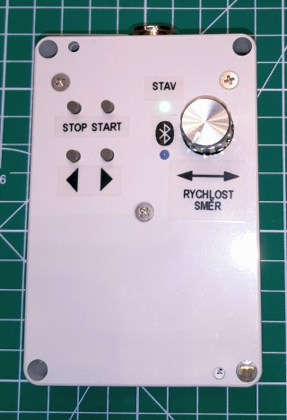
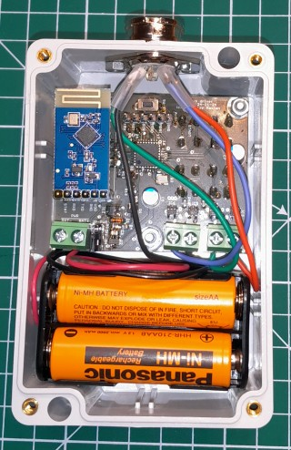
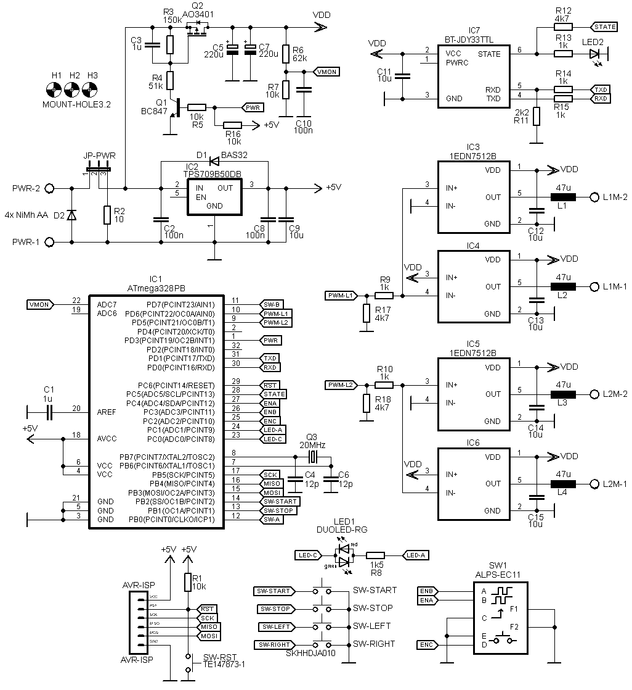
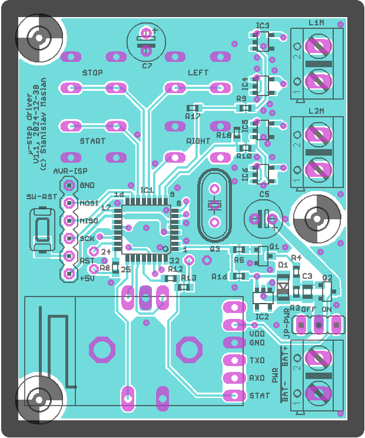
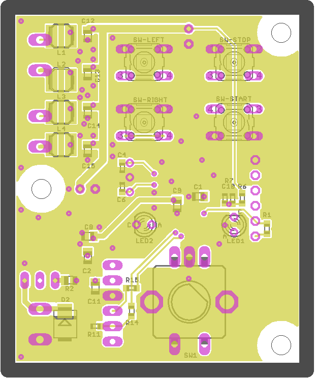
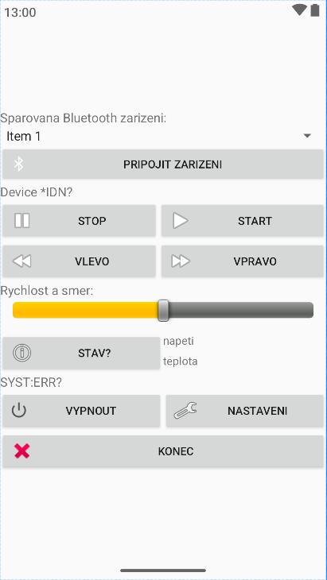

# Stepper Motor Controller

This is simple project of one stepper motor controller designed for Czech toy 
[Merkur](https://www.merkurtoys.cz). It has manual speed and direction controlls and Bluetooth module for remote control via terminal commands or Android app. 
I don't expect this project as a whole would be useful to most people
but it may serve as a source for canibalization of some of its parts.




## Hardware

It was designed in a hurry from parts I had on hand so it's far from being optimal.
Core of the controller is 8-bit AVR [ATmega328PB](https://www.microchip.com/en-us/product/atmega328pb) (ATmega168PB would be enough). 
I used stepper motor [NEMA 17HS4023](https://www.google.com/search?q=NEMA+17+17HS4023) with bipolar coils.
I did not have proper stepper controller IC on hand, so I used cheap GaN fet driver ICs 
[1EDN7512B](https://www.infineon.com/cms/en/product/power/gate-driver-ics/1edn7512b/) with MOSFET half-bridge output.
These chips have undervoltage lockout (UVLO) circuit with threshold around 4.2V, which is kind of risky, because one of the bridge ICs will go to 
UVLO state before the other one, so there may be uninteruptable current via the winding when UVLO goes active. It won't be destructive, but it will discharge battery even faster, 
so UVLO is detected by AVR and it turns off power stage before it happens. Remote communication is made using cheap BT module
[JDY33-TTL](https://www.google.com/search?q=jdy33+ssp). Power stage, BT module and voltage sensing circuit can be switched off 
by power MOSFET to reduce idle power consumption to near zero (approx 2uA). Intended supply is from 4xAA NiMH accumulators, so there is 
5V voltage regulator for AVR. I used ultra-low quiscent current LDO TI [TPS709B50](https://www.ti.com/product/TPS709). 
Controlls are four buttons (Start, Stop, Left, Right) and encoder to setup speed.



The whole module was designed to fit in [plastic box](https://www.tme.eu/cz/details/km-276i_g/univerzalni-krabicky/maszczyk/). I wanted to make it smaller, but batteries are a bit large. Maybe in the next version. [PCB and diagram](./stepper_ctrl/) are available in Eagle format.




## AVR Firmware

Firmware for AVR is written in [Microchip Studio](https://www.microchip.com/en-us/tools-resources/develop/microchip-studio) using AVRGCC. 
Motor bridges are controlled by AVR PWM outputs which generate sine and cosine waves with modulation frequency of 78.125kHz, so it is kind of micro stepping driver. 
There is no current feedback from the stepper windings, so the current is controlled empirically by changing sine and consine amplitudes depending on motor speed. For the selected motor it should be approx 200 - 250mA with no load. Maximum speed is limited to 270rpm.
Reception of data via BT module is made in ISR to round buffer. Processing of the commands is done in main loop as well as controls state machine and other non-critical operations. Command interface uses simple [SCPI command](https://en.wikipedia.org/wiki/Standard_Commands_for_Programmable_Instruments) style commands set. Each command must be terminated by LF. Commands can be chained by semicolon. Answers are terminated by LF. Communication runs on BT module's default 9600bd. BT device name and its MAC address was left on default. List of supported commands:

```
 *IDN?                   - Return identification string.
 *OPC?                   - Wait for previous commands being processed, then returns 1.
 SYST:ERR?               - Return last error string.
 SYST:VMON?              - Return system voltage [V].
 SYST:TEMP?              - Return system temperature [degC].
 SYST:EESAVE             - Store current setup to EEPROM.
 SLEEP                   - Go to sleep mode immediately.
 SLEEP:TIMEOUT <timeout> - set sleep mode timeout [s].
 SLEEP:TIMEOUT?          - Get sleep timeout [s].
 SPEED <speed>           - Set motor speed in [rpm], signed value to set direction.
 SPEED?                  - Get current motor speed [rpm].
 SPEED:SET?              - Get last target (set) speed [rpm].
 SPEED:LIMIT <speed>     - Set speed limit [rpm].
 SPEED:LIMIT?            - Get speed limit [rpm].
 MOT:ACC <acc>           - Set motor acceleration constant [rpm/s].
 MOT:ACC?                - Get motor acceleration constant [rpm/s].
 START                   - Start motor to last set speed and direcion.
 STOP                    - Stop motor.
 DIR <direction>         - set motor direction (CW or CCW) 
                           and eventually start motor to previous speed.
```

Controller has implemented timeout timer, so when no controls are changed or SCPI command received, it will go to power down mode. It will respond to START button press to wakeup. It can be forced to power down mode by holding STOP button or by SCPI command SLEEP. Battery voltage is measured continuously. When it drops below preset threshold it will start blinking red and eventually turn off.

AVR fuse bits:
```
 Extended byte: CFD = 0, BODLEVEL[2..0] = 101 
 High byte: BOOTRST = 1, BOOTSZ[1..0] = 00, EESAVE = 0, WDTON = 1, SPIEN = 0, DWEN = 0, RSTDISBL = 1
 Low byte: CKSEL[3..0] = 1111, SUT[1..0] = 11, CKOUT = 1, CKDIV8 = 1
```

Firmware is available at [stepper_ctrl/fw_stepper_v1/](./stepper_ctrl/fw_stepper_v1).

## Android controll app "Merkur Motor"

Stepper controller can be controlled by terminal, but it's not exactly practical, so I decided to make an app for Android. This was my first atempt ever, so be warned it is not nice and optimal code but may be still used to cannibalize some parts. 
After some reading I decided to give a try to [Android Studio](https://developer.android.com/studio) and popular language [Kotlin](https://kotlinlang.org). That turned out to be good choice. Especially Kotlin is nice and simple language compared to e.g. C++. 
At first I tried to use some BT serial libraries, but I was not able to deal with collisions between some libraries so I tried to make BT communication using basic libraries. That was simpler than expected. Basically just list paired BT devices, select one, open BT socket and get in/out streams. Done. The worst part was dealing with permissions and trying to deal with loss of communication e.g. when the BT device goes offline. But in the end it kind of works at least from Android 11 to 14. Source is available at [MerkurControl/](./MerkurControl/).




## License
All parts of the project are distributed under [MIT license](./README.txt).
